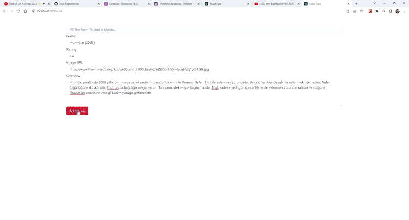
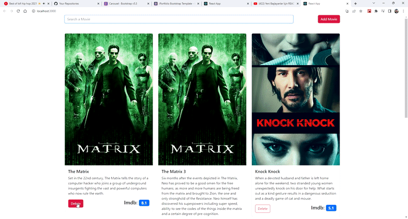
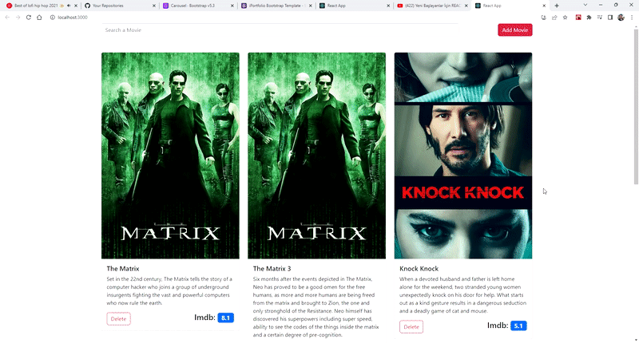

# Proje Hakkında:

Proje, bir film listesi uygulamasıdır. Kullanıcılar film arayabilir, film ekleyebilir veya film silebilir. Proje aşağıdaki bileşenlerden oluşur:

## AddMovie:

 Bu bileşen, kullanıcının yeni bir film eklemesine izin verir. Bir form oluşturur ve form verilerini bir FormData nesnesine dönüştürür. Ardından axios kütüphanesini kullanarak verileri bir API’ye gönderir ve sayfayı yeniler.  

## AddMovieApp: 

Bu bileşen, AddMovie bileşenini döndürür. AddMovie bileşenine bir onAddMovie prop’u geçirir.  

 

## App: 

 Bu bileşen, uygulamanın ana bileşenidir. movies ve moviesStatic adında iki state değişkeni tutar. componentDidMount metodu ile axios kütüphanesini kullanarak iki API’den film 
 verilerini alır ve state’i günceller. deleteMovie metodu ile bir filmi state’ten siler. filterMovie metodu ile bir arama metnine göre filmleri filtreler. SearchBar ve MovieList bileşenlerini döndürür.  

## MovieList: 

 Bu bileşen, filmlerin bir listesini gösterir. props olarak movies ve movieDelFunc alır. movies dizisini map metodu ile Video bileşenlerine dönüştürür ve her birine key ve video prop’ları geçirir.  

  

## SearchBar: 

 Bu bileşen, kullanıcının filmleri aramasına izin verir. state olarak searchQuery adında bir değişken tutar. onChange olayı ile state’i günceller ve props olarak aldığı movieFilterFunc fonksiyonunu çağırır. Ayrıca bir Add Movie butonu oluşturur ve onClick olayı ile sayfayı /add adresine yönlendirir.  

  

Bu proje React kütüphanesinin temel kavramlarını kullanır: JSX, state, props, olaylar, yaşam döngüsü metotları ve fonksiyonel bileşenler. React projelerinin yapısını iyileştirmek için daha ileri düzey konseptler de kullanılabilir: React Context, React Router, React Hooks gibi.